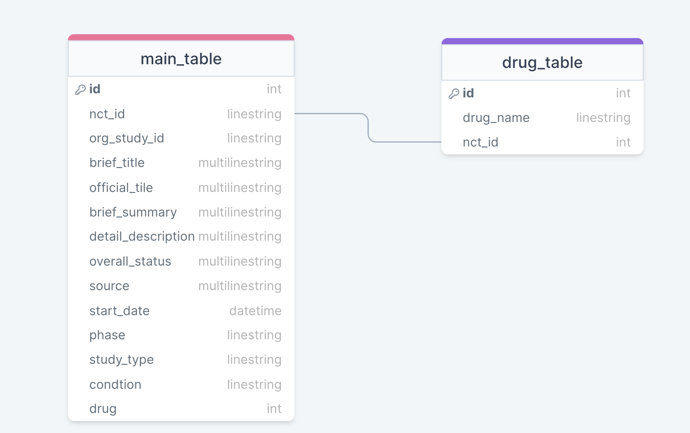

# Clinical Trials prediction dataset exploration
This repo containts the extraction of the XML information from the Clinical Trial Prediction Dataset from Kaggle

## Generating the SQL database
The current schema looks like this and it may change in the future. 


WIP: script to create and upload the SQL database

## How to download
```bash
git clone https://github.com/jaimebw/ctp_db.git
```

Author: Jaime Bowen Varela